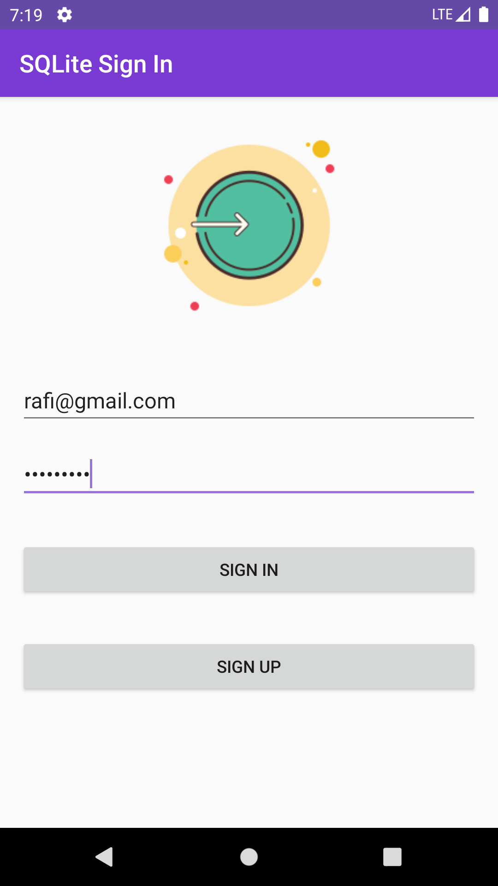
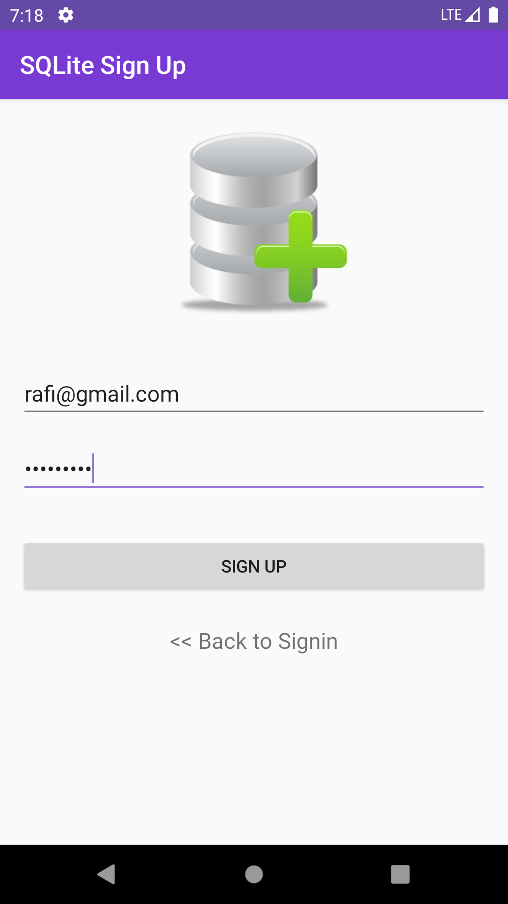
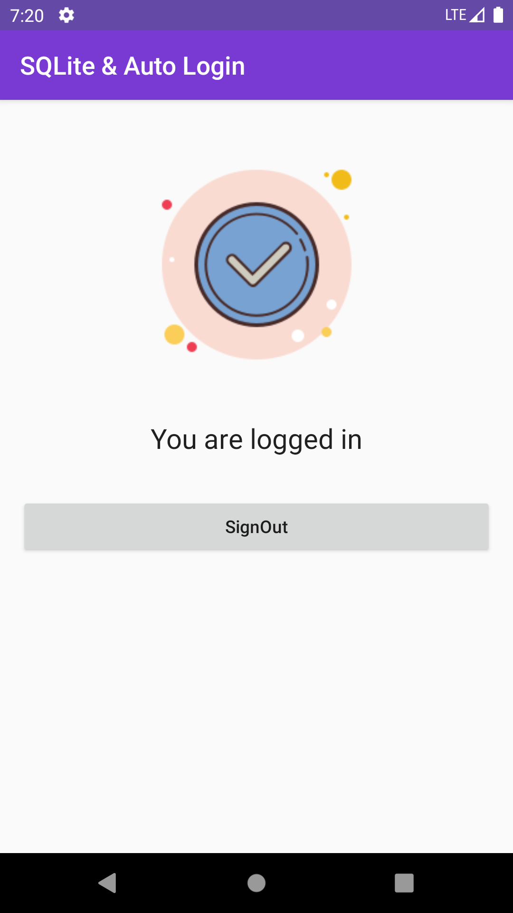

# SQLite Database and Auto Login

This project is for learning sign in, sign up using SQLite database and keep user loggedin feature in Android App Development.

### SQLite Database
  - Sign up
  - Sign in
  - Keep User Loggedin
 
## Screenshots
 &nbsp;&nbsp;&nbsp;&nbsp;&nbsp;&nbsp;&nbsp;&nbsp;&nbsp;&nbsp; &nbsp;&nbsp;&nbsp;&nbsp;&nbsp;&nbsp;&nbsp;&nbsp;&nbsp;&nbsp; 
